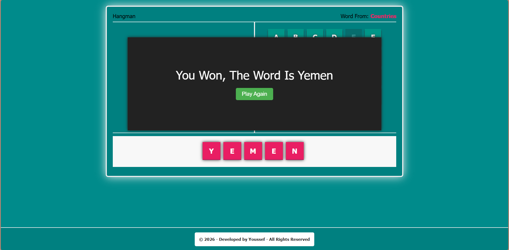
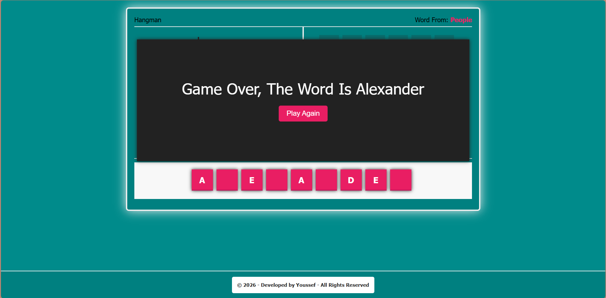
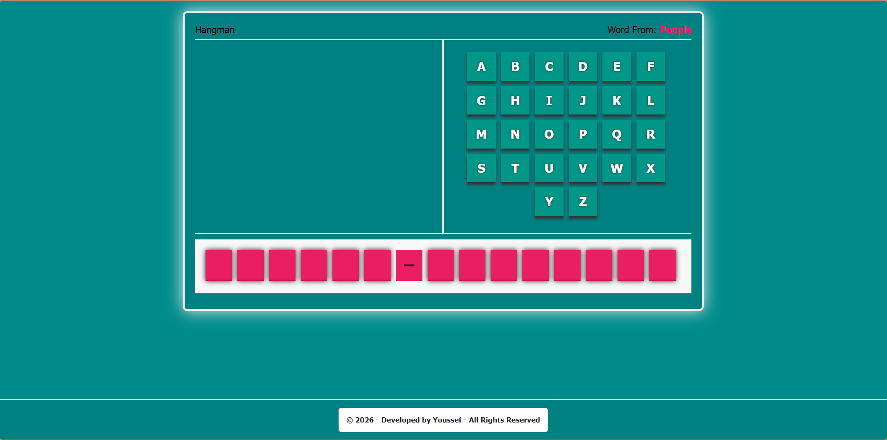

# 🎮 Hangman Game

🎮 A modern, interactive Hangman game with responsive design, sound effects, and smooth animations built with pure JavaScript.

## 📸 Screenshots

### 🏆 Win State


### 😔 Lose State  


### 🎮 Main Interface


## ✨ Features
📱 Responsive design for all devices
🎵 Sound effects and animations
🔄 Play again functionality
🏆 Win/Loss detection system
🎯 Multiple word categories
⌨️ Interactive letter selection

## 🛠️ Technologies Used


## 🎮 How to Play
1. Open `index.html` in your browser
2. Click on letters to guess the hidden word
3. Wrong guesses will draw parts of the hangman
4. Win by guessing the complete word before the hangman is fully drawn
5. Use the "Play Again" button to start a new game with a random word

## 📂 Project Structure
```
hangman-game/
├── index.html          # Main HTML file
├── main.css            # Styling and responsive design
├── main.js             # Game logic and interactions
├── README.md           # Project documentation
├── screenshots/        # Game screenshots
│   ├── win-state.png
│   ├── lose-state.png
│   └── main-interface.png
└── audio/              # Sound effects
    ├── success.mp3
    └── fail.mp3
```

## 🎯 Word Categories
- **Programming** - php, javascript, python, etc.
- **Movies** - Prestige, Inception, Parasite, etc.
- **People** - Albert Einstein, Cleopatra, etc.
- **Countries** - Syria, Egypt, Palestine, etc.

## 🎯 Game Engine Logic
### 🔄 Attempt Tracking System
- **Progressive State Management** - 8-stage wrong attempt tracking
- **Dynamic SVG Rendering** - Incremental hangman drawing based on game state
- **Game State Machine** - Win/Loss detection with automatic reset functionality
- **Category-Based Word Selection** - Random word picker from themed categories

### 🎵 Audio API Integration
- **Web Audio API** - Dynamic sound effect loading and playback
- **Event-Driven Audio** - Contextual audio feedback for user actions
- **Cross-Browser Compatibility** - Fallback mechanisms for audio support

## 📱 Fully Responsive
- 🖥️ Desktop - Full keyboard experience
- 📱 Tablet - Optimized touch interface
- 📱 Mobile - Compact and user-friendly

## 🚀 Getting Started
1. Clone this repository
2. Open `index.html` in your web browser
3. Start playing immediately!

## 🌐 Play Online
**🔗 [Play the Game Here](https://youssefali2002.github.io/Hangman-Game/)**

Experience the game directly in your browser without any installation!

## �🌟 Game Features
- **8 Wrong Attempts** - Progressive hangman drawing
- **Sound Feedback** - Success and failure sounds
- **Smooth Animations** - CSS transitions and effects
- **Instant Replay** - Play again without page reload
- **Category Display** - Shows current word category

## 🎨 Design Highlights
- Modern teal and darkcyan color scheme
- Smooth hover effects and transitions
- Professional popup messages
- Clean and intuitive interface

---

**Built with ❤️ using HTML, CSS, and JavaScript**

---

## 🌐 Bilingual Documentation

### 📖 English Version
[View English Documentation](#readme)

### 📖 Arabic Version
[عرض الوثائق العربية](#arabic-readme)

---

# 🎮 لعبة Hangman

🎮 لعبة Hangman تفاعلية حديثة مع تصميم متجاوب، مؤثرات صوتية، ورسوم متحركة سلسة مبنية بـ JavaScript خالص.

## 📸 لقطات الشاشة

### 🏆 حالة الفوز


### 😔 حالة الخسارة  


### 🎮 الواجهة الرئيسية


## ✨ المميزات
📱 تصميم متجاوب لجميع الأجهزة
🎵 مؤثرات صوتية ورسوم متحركة
🔄 إمكانية اللعب مرة أخرى
🏆 نظام كشف الفوز والخسارة
🎯 تصنيفات كلمات متعددة
⌨️ اختيار الحروف تفاعلي

## 🛠️ التقنيات المستخدمة


## 🎮 كيفية اللعب
1. افتح `index.html` في متصفحك
2. اضغط على الحروف لتخمين الكلمة المخفية
3. التخمينات الخاطئة سترسم أجزاء من الرجل المعلق
4. اربح بتخمين الكلمة الكاملة قبل رسم الرجل بالكامل
5. استخدم زر "العب مرة أخرى" لبدء لعبة جديدة بكلمة عشوائية

## 📂 هيكل المشروع
```
hangman-game/
├── index.html          # ملف HTML الرئيسي
├── main.css            # التنسيق والتصميم المتجاوب
├── main.js             # منطق اللعبة والتفاعلات
├── README.md           # وثائق المشروع
├── screenshots/        # لقطات شاشة اللعبة
│   ├── win-state.png
│   ├── lose-state.png
│   └── main-interface.png
└── audio/              # المؤثرات الصوتية
    ├── success.mp3
    └── fail.mp3
```

## 🎯 تصنيفات الكلمات
- **البرمجة** - php, javascript, python, إلخ.
- **الأفلام** - Prestige, Inception, Parasite, إلخ.
- **الأشخاص** - Albert Einstein, Cleopatra, إلخ.
- **الدول** - Syria, Egypt, Palestine, إلخ.

## 🎯 منطق محرك اللعبة
### 🔄 نظام تتبع المحاولات
- **إدارة الحالة التدريجية** - تتبع المحاولات الخاطئة في 8 مراحل
- **رسم SVG ديناميكي** - رسم الرجل المعلق تدريجياً بناءً على حالة اللعبة
- **آلة حالة اللعبة** - كشف الفوز/الخسارة مع إعادة تعيين تلقائية
- **اختيار الكلمات حسب التصنيف** - منتقي كلمات عشوائي من تصنيفات مواضيعية

### 🎵 تكامل Audio API
- **Web Audio API** - تحميل وتشغيل ديناميكي للمؤثرات الصوتية
- **صوت مدفوع بالأحداث** - تغذية صوتية سياقية لتفاعلات المستخدم
- **توافق المتصفحات** - آليات احتياطية لدعم الصوت

## 📱 متجاوب بالكامل
- 🖥️ الكمبيوتر - تجربة لوحة مفاتيح كاملة
- 📱 التابلت - واجهة لمس محسّنة
- 📱 الموبايل - تصميم مدمج وسهل الاستخدام

## 🚀 البدء
1. استنساخ هذا المستودع
2. افتح `index.html` في متصفح الويب الخاص بك
3. ابدأ اللعب فوراً!

## 🌐 العب أونلاين
**🔗 [العب اللعبة هنا](https://youssefali2002.github.io/Hangman-Game/)**

جرب اللعبة مباشرة في متصفحك بدون أي تثبيت!

## 🌟 مميزات اللعبة
- **8 محاولات خاطئة** - رسم الرجل المعلق تدريجياً
- **تغذية صوتية** - أصوات النجاح والفشل
- **رسوم متحركة سلسة** - انتقالات وتأثيرات CSS
- **إعادة فورية** - العب مرة أخرى بدون إعادة تحميل الصفحة
- **عرض التصنيف** - يعرض تصنيف الكلمة الحالية

## 🎨 نقاط التصميم
- مخطط ألوان حديث باللون الأزرق المائي والأزرق الداكن
- تأثيرات hover سلسة وانتقالات
- رسائل احترافية منبثقة
- واجهة نظيفة وبديهية
